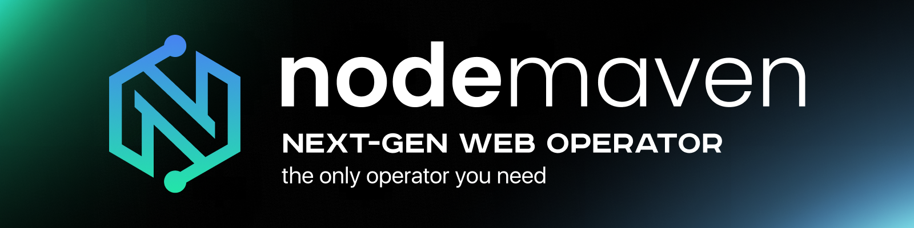

<div align="center">

<!-- The logo is the one thing in this file that is not text, and the asset is not
     committed yet. Drop a transparent PNG or SVG at profile/assets/nodemaven-logo.png
     (see profile/assets/README.md for size) and delete the comment markers around the
     two lines below. A missing image renders as a broken icon on the organization
     landing page, which is why it is commented out rather than left hopeful. -->

<a href="https://nodemaven.com/?utm_term=github&utm_content=nodemaven_readme"></a>

# NodeMaven

Residential and mobile proxy infrastructure. Open tooling that proves it works.

<a href="https://nodemaven.com/?utm_term=github&utm_content=nodemaven_readme"></a>
<a href="https://docs.nodemaven.com?utm_source=github&utm_medium=org_profile&utm_campaign=badge"></a>
<a href="https://t.me/node_maven"></a>
<a href="https://x.com/NodeMaven"></a>
<a href="https://www.linkedin.com/company/nodemaven"></a>

</div>

<!-- One badge style per row, and repository-status badges are deliberately not up
     here: a CI gate, a licence and a row count belong to proxy-benchmark rather
     than to the organization, so they sit beside that repository in Tools below.
     Five social badges in one style is the shape an org landing page reads best in. -->

---
<!--
## What is here

Two kinds of repository. **SDKs** wrap the gateway in one language each, so you are not
hand-building proxy usernames or wiring auth into a browser. **Tools** are the things we
built to answer our own questions and had no reason to keep private - chief among them a
benchmark harness that measures block rates against live targets for any provider,
including ours.

| I want to... | Go to |
|---|---|
| Make my first request through a proxy in under 10 minutes | [Quickstart](https://docs.nodemaven.com?utm_source=github&utm_medium=org_profile&utm_campaign=quickstart) |
| Never have seen a terminal before and still get a row of data | [proxy-benchmark quickstart](https://github.com/nodemaven/proxy-benchmark/blob/main/docs/quickstart.md) |
| Use NodeMaven from my language | [SDKs](#sdks) |
| Work out why a target is blocking me | [The three layers](https://github.com/nodemaven/proxy-benchmark#what-it-measures) |
| Measure my own proxies, ours or anybody's | [proxy-benchmark](https://github.com/nodemaven/proxy-benchmark) |
| Check a number we published, offline, without an account | [Reproduce these numbers](https://github.com/nodemaven/proxy-benchmark#reproduce-these-numbers) |
-->
## What a request looks like

The gateway takes its parameters in the username, separated by hyphens, so any HTTP client
in any language can reach it without a library:

```python
import requests

proxy = "http://<login>-country-us-sid-abc123-ttl-10m:<password>@gate.nodemaven.com:8080"
r = requests.get("https://ipinfo.io/json", proxies={"http": proxy, "https": proxy})
print(r.json()["ip"])
```

`sid` holds one exit across requests, `ttl` says for how long. The sticky key is the whole
parameter set rather than `sid` alone, which is the kind of thing you find by probing a
gateway rather than by reading its documentation - so we probed ours and
[wrote down what it answers](https://github.com/nodemaven/proxy-benchmark/blob/main/CLAUDE.md#measured-gateway-behaviour),
including the seven malformed inputs and the seven different replies, none of which names
the cause. One of them is a 200 with your setting silently dropped, so a run can complete
while every row claims a parameter that was never applied.

---

## Repositories

### SDKs

| Package | Registry | Status |
|---|---|---|
| `nodemaven-python` | PyPI | In development |
| `nodemaven-node` | npm | Planned |
| `nodemaven-go` | Go module | Planned |
| `nodemaven-rust` | crates.io | Planned |

None of these are published yet, so none of them are linked - a name in this table becomes
a link on the day the repository is public, and not before.

Every SDK covers the same ground: typed connection parameters with client-side validation,
browser adapters that handle proxy auth for you, traffic-saving presets, and rotation with a
circuit breaker so a bad run does not make itself worse.
<!--
### Tools

| Repository | What it does | Language |
|---|---|---|
| [proxy-benchmark](https://github.com/nodemaven/proxy-benchmark) | Measures pass, captcha and block rates against live targets, for any provider and eleven browser engines | Python |

[](https://github.com/nodemaven/proxy-benchmark/actions/workflows/ci.yml)
[](https://github.com/nodemaven/proxy-benchmark/blob/main/LICENSE)
[](https://github.com/nodemaven/proxy-benchmark)
[](https://github.com/nodemaven/proxy-benchmark/tree/main/data/runs)
-->
---

## We publish our numbers, including the ones we lose on

Most proxy benchmarks are marketing. Ours is a repository you can run: every verdict is
read off the response body rather than the status code, every row lands in JSONL you can
re-read offline, and the runner has never been told which provider it is talking to - it
takes a host, a port and a username out of the environment, so pointing it at a
competitor's gateway, or at the proxies you already own, is a credentials change rather
than a code change.

Each question below is a matrix whose arms are interleaved inside one time window, with a
fresh exit per probe. Two arms run at 10:00 and 14:00 would measure the hour rather than
the thing under test, so the runner goes round-robin across cells and never in sequence.

| What we tested | Result | Sample |
|---|---|---|
| Does a proven exit keep working? | **Yes. 108/109 held queries pass, 99%** | 120 identities, one 1 h 54 window |
| Does warming an exit first help? | **No effect.** 32% vs 30%, Fisher p = 1.0 | same run, both arms interleaved |
| Does pinning `country=us` help? | **No, it costs you.** 13% vs 52% for every other setting, p = 1.5e-05 | 225 attempts over two windows |
| Is the browser the bottleneck on Google? | **No, it is the address.** Of the pages Google served, the script-running engines parsed every one: patchright 309/309, zendriver 169/169 | every run on disk |
| Is there a best anti-detect framework? | **No. It is a diagonal** - the winner changes with the target | every run on disk |

The `country=us` row is about our own product, and it stays in the table. A benchmark that
only shows wins is worth nothing to the person forking it.

Two caveats we would want if we were reading someone else's table. The hold figure is
conditional and censored: every held query follows a probe the target already served, and
a series stops at its first refusal, so later positions are drawn from survivors. And every
rate here is a reading of the hours it was taken in - one target's yield moved 17 points
between two afternoons of the same day, which is why the sample column names the window and
why the repository keeps the claims that did not survive replication next to the ones that
did.

Every figure above comes out of a command that reads committed rows and sends nothing:

```bash
git clone https://github.com/nodemaven/proxy-benchmark && cd proxy-benchmark
pip install -r requirements-ci.txt
python scripts/analysis/report.py --all     # the pass rates and the denominators
python scripts/analysis/held.py             # the hold, the warm arm, the filter ladder
```

**[Read the methodology and re-run it yourself](https://github.com/nodemaven/proxy-benchmark)**

---


## Contributing

Issues and pull requests are welcome on every repository here, including ones that tell us our
numbers are wrong. If you can reproduce a result that contradicts ours, open an issue with the
raw rows - that is the most useful thing you can send us.

See [CONTRIBUTING.md](https://github.com/nodemaven/.github/blob/main/CONTRIBUTING.md).

Security reports: [SECURITY.md](https://github.com/nodemaven/.github/blob/main/SECURITY.md).

---

<div align="center">

[nodemaven.com](https://nodemaven.com/?utm_term=github&utm_content=nodemaven_readme) ·
[Docs](https://docs.nodemaven.com?utm_source=github&utm_medium=org_profile&utm_campaign=footer) ·
[X](https://x.com/NodeMaven) ·
[LinkedIn](https://www.linkedin.com/company/nodemaven) ·
[Telegram](https://t.me/node_maven) ·
[support@nodemaven.com](mailto:support@nodemaven.com)

</div>
